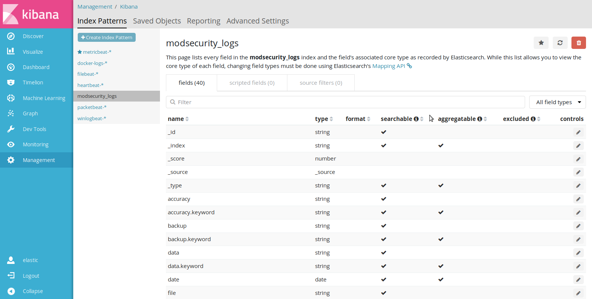
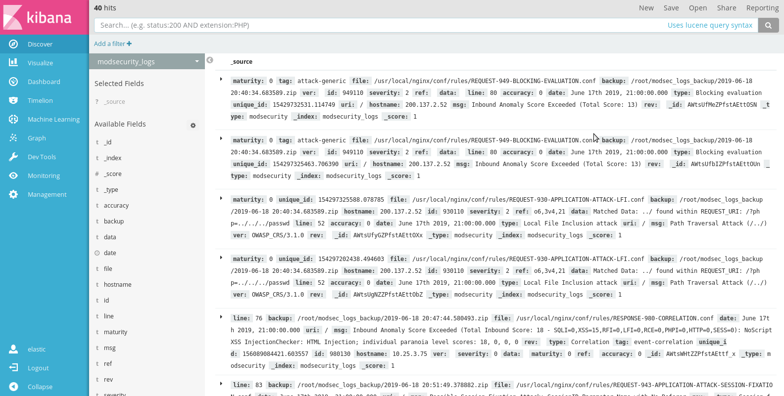
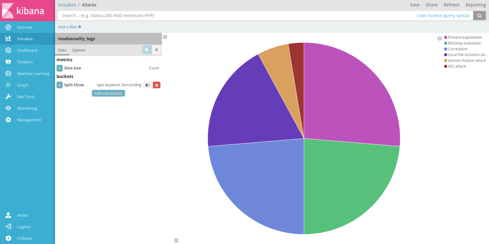

# ModSecurity parser
A script to send ModSecurity logs to Elasticsearch

ModSecurity is a Web Application Firewall (WAF) for Apache and Nginx servers. It has logging capabilities and it is able to monitor HTTP traffic in order to mitigate attacks in real time. Elasticsearch is a search engine which can power extremely fast searches. The objective of this script is to send ModSecurity logs to Elasticsearch in order to be able to visualize them on Kibana.

### ModSecurity logs

The default logs look like this:
```
---dt9xdeik---A--
[18/Jun/2019:20:52:38 +0000] 156089115890.272782 10.25.3.75 54968 10.25.3.75 8080
---dt9xdeik---B--
GET /?command=ping%2010.0.0.1;%20cat%20/etc/passwd HTTP/1.1
Host: 10.25.3.75:8080
User-Agent: Mozilla/5.0 (X11; Ubuntu; Linux x86_64; rv:67.0) Gecko/20100101 Firefox/67.0
Cookie: sid=Fe26.2**eea4ff29ce512cebcd40476ba7b3553b115981f39aee4c99a3d596adb0caf114*pxOW22uyKBM3BYacDKNBDQ*48jyCicpWf06ltgoyqqvjKWP3QUZboRfILkiLFEXHLaClA_r9D8FAsXoiUt5-MU7VnaVAm_E3EymUOzOFcTvPA**f97ca8cf9344e7065729e38497d5c562bac756d5dccf35bbf8061fc1828d70b1*C9xs9fCPlcbVu4nWPwb4tfb3Irr7R6QI_kL9p1474-E
Accept: text/html,application/xhtml+xml,application/xml;q=0.9,*/*;q=0.8
Accept-Language: en-US,en;q=0.5
Accept-Encoding: gzip, deflate
Connection: keep-alive
Upgrade-Insecure-Requests: 1

---dt9xdeik---D--

---dt9xdeik---E--
<html>\x0d\x0a<head><title>403 Forbidden</title></head>\x0d\x0a<body bgcolor="white">\x0d\x0a<center><h1>403 Forbidden</h1></center>\x0d\x0a<hr><center>nginx/1.14.1</center>\x0d\x0a</body>\x0d\x0a</html>\x0d\x0a

---dt9xdeik---F--
HTTP/1.1 403
Server: nginx/1.14.1
Date: Tue, 18 Jun 2019 20:52:38 GMT
Content-Length: 169
Content-Type: text/html
Connection: keep-alive

---dt9xdeik---H--
ModSecurity: Warning. Matched "Operator `Rx' with parameter `^[\d.:]+$' against variable `REQUEST_HEADERS:Host' (Value: `10.25.3.75:8080' ) [file "/usr/local/nginx/conf/rules/REQUEST-920-PROTOCOL-ENFORCEMENT.conf"] [line "762"] [id "920350"] [rev ""] [msg "Host header is a numeric IP address"] [data "10.25.3.75:8080"] [severity "4"] [ver "OWASP_CRS/3.1.0"] [maturity "0"] [accuracy "0"] [tag "application-multi"] [tag "language-multi"] [tag "platform-multi"] [tag "attack-protocol"] [tag "OWASP_CRS/PROTOCOL_VIOLATION/IP_HOST"] [tag "WASCTC/WASC-21"] [tag "OWASP_TOP_10/A7"] [tag "PCI/6.5.10"] [hostname "10.25.3.75"] [uri "/"] [unique_id "156089115890.272782"] [ref "o0,15v66,15"]
ModSecurity: Warning. Matched "Operator `PmFromFile' with parameter `lfi-os-files.data' against variable `ARGS:command' (Value: `ping 10.0.0.1; cat /etc/passwd' ) [file "/usr/local/nginx/conf/rules/REQUEST-930-APPLICATION-ATTACK-LFI.conf"] [line "78"] [id "930120"] [rev ""] [msg "OS File Access Attempt"] [data "Matched Data: etc/passwd found within ARGS:command: ping 10.0.0.1; cat /etc/passwd"] [severity "2"] [ver "OWASP_CRS/3.1.0"] [maturity "0"] [accuracy "0"] [tag "application-multi"] [tag "language-multi"] [tag "platform-multi"] [tag "attack-lfi"] [tag "OWASP_CRS/WEB_ATTACK/FILE_INJECTION"] [tag "WASCTC/WASC-33"] [tag "OWASP_TOP_10/A4"] [tag "PCI/6.5.4"] [hostname "10.25.3.75"] [uri "/"] [unique_id "156089115890.272782"] [ref "o20,10v14,30t:utf8toUnicode,t:urlDecodeUni,t:normalizePathWin,t:lowercase"]
ModSecurity: Warning. Matched "Operator `Rx' with parameter `(?:;|\{|\||\|\||&|&&|\n|\r|\$\(|\$\(\(|`|\${|<\(|>\(|\(\s*\))\s*(?:{|\s*\(\s*|\w+=(?:[^\s]*|\$.*|\$.*|<.*|>.*|\'.*\'|\".*\")\s+|!\s*|\$)*\s*(?:'|\")*(?:[\?\*\[\]\(\)\-\|+\w'\"\./\\\\]+/)?[\\\\'\"]*(?: (5210 characters omitted)' against variable `ARGS:command' (Value: `ping 10.0.0.1; cat /etc/passwd' ) [file "/usr/local/nginx/conf/rules/REQUEST-932-APPLICATION-ATTACK-RCE.conf"] [line "99"] [id "932100"] [rev ""] [msg "Remote Command Execution: Unix Command Injection"] [data "Matched Data: ; cat /etc/passwd found within ARGS:command: ping 10.0.0.1; cat /etc/passwd"] [severity "2"] [ver "OWASP_CRS/3.1.0"] [maturity "0"] [accuracy "0"] [tag "application-multi"] [tag "language-shell"] [tag "platform-unix"] [tag "attack-rce"] [tag "OWASP_CRS/WEB_ATTACK/COMMAND_INJECTION"] [tag "WASCTC/WASC-31"] [tag "OWASP_TOP_10/A1"] [tag "PCI/6.5.2"] [hostname "10.25.3.75"] [uri "/"] [unique_id "156089115890.272782"] [ref "o13,17v14,30"]
ModSecurity: Warning. Matched "Operator `Rx' with parameter `(?:^|=)\s*(?:{|\s*\(\s*|\w+=(?:[^\s]*|\$.*|\$.*|<.*|>.*|\'.*\'|\".*\")\s+|!\s*|\$)*\s*(?:'|\")*(?:[\?\*\[\]\(\)\-\|+\w'\"\./\\\\]+/)?[\\\\'\"]*(?:l[\\\\'\"]*(?:s(?:[\\\\'\"]*(?:b[\\\\'\"]*_[\\\\'\"]*r (6252 characters omitted)' against variable `ARGS:command' (Value: `ping 10.0.0.1; cat /etc/passwd' ) [file "/usr/local/nginx/conf/rules/REQUEST-932-APPLICATION-ATTACK-RCE.conf"] [line "448"] [id "932150"] [rev ""] [msg "Remote Command Execution: Direct Unix Command Execution"] [data "Matched Data: ping  found within ARGS:command: ping 10.0.0.1; cat /etc/passwd"] [severity "2"] [ver "OWASP_CRS/3.1.0"] [maturity "0"] [accuracy "0"] [tag "application-multi"] [tag "language-shell"] [tag "platform-unix"] [tag "attack-rce"] [tag "OWASP_CRS/WEB_ATTACK/COMMAND_INJECTION"] [tag "WASCTC/WASC-31"] [tag "OWASP_TOP_10/A1"] [tag "PCI/6.5.2"] [hostname "10.25.3.75"] [uri "/"] [unique_id "156089115890.272782"] [ref "o0,5v14,30"]
ModSecurity: Warning. Matched "Operator `PmFromFile' with parameter `unix-shell.data' against variable `ARGS:command' (Value: `ping 10.0.0.1; cat /etc/passwd' ) [file "/usr/local/nginx/conf/rules/REQUEST-932-APPLICATION-ATTACK-RCE.conf"] [line "481"] [id "932160"] [rev ""] [msg "Remote Command Execution: Unix Shell Code Found"] [data "Matched Data: etc/passwd found within ARGS:command: ping 10.0.0.1 cat/etc/passwd"] [severity "2"] [ver "OWASP_CRS/3.1.0"] [maturity "0"] [accuracy "0"] [tag "application-multi"] [tag "language-shell"] [tag "platform-unix"] [tag "attack-rce"] [tag "OWASP_CRS/WEB_ATTACK/COMMAND_INJECTION"] [tag "WASCTC/WASC-31"] [tag "OWASP_TOP_10/A1"] [tag "PCI/6.5.2"] [hostname "10.25.3.75"] [uri "/"] [unique_id "156089115890.272782"] [ref "o18,10v14,30t:urlDecodeUni,t:cmdLine,t:normalizePath,t:lowercase"]
ModSecurity: Access denied with code 403 (phase 2). Matched "Operator `Ge' with parameter `5' against variable `TX:ANOMALY_SCORE' (Value: `23' ) [file "/usr/local/nginx/conf/rules/REQUEST-949-BLOCKING-EVALUATION.conf"] [line "80"] [id "949110"] [rev ""] [msg "Inbound Anomaly Score Exceeded (Total Score: 23)"] [data ""] [severity "2"] [ver ""] [maturity "0"] [accuracy "0"] [tag "application-multi"] [tag "language-multi"] [tag "platform-multi"] [tag "attack-generic"] [hostname "10.25.3.75"] [uri "/"] [unique_id "156089115890.272782"] [ref ""]
ModSecurity: Warning. Matched "Operator `Ge' with parameter `5' against variable `TX:INBOUND_ANOMALY_SCORE' (Value: `23' ) [file "/usr/local/nginx/conf/rules/RESPONSE-980-CORRELATION.conf"] [line "76"] [id "980130"] [rev ""] [msg "Inbound Anomaly Score Exceeded (Total Inbound Score: 23 - SQLI=0,XSS=0,RFI=0,LFI=5,RCE=15,PHPI=0,HTTP=0,SESS=0): Remote Command Execution: Unix Shell Code Found; individual paranoia level scores: 23, 0, 0, 0"] [data ""] [severity "0"] [ver ""] [maturity "0"] [accuracy "0"] [tag "event-correlation"] [hostname "10.25.3.75"] [uri "/"] [unique_id "156089115890.272782"] [ref ""]

---dt9xdeik---I--

---dt9xdeik---J--

---dt9xdeik---Z--
```

After executing the script:
```
{"maturity": "0", "tag": "PCI/6.5.10", "file": "/usr/local/nginx/conf/rules/REQUEST-920-PROTOCOL-ENFORCEMENT.conf", "type": "Prevent exploitation\n", "rev": "", "ver": "OWASP_CRS/3.1.0", "backup": "/root/modsec_logs_backup/2019-06-18 20:56:30.077214.zip", "msg": "Host header is a numeric IP address", "uri": "/", "id": "920350", "line": "762", "severity": "4", "hostname": "10.25.3.75", "data": "10.25.3.75:8080", "ref": "o0,15v66,15", "accuracy": "0", "unique_id": "156089115890.272782", "date": "2019/06/18"}

{"maturity": "0", "tag": "PCI/6.5.4", "file": "/usr/local/nginx/conf/rules/REQUEST-930-APPLICATION-ATTACK-LFI.conf", "type": "Local File Inclusion attack\n", "rev": "", "ver": "OWASP_CRS/3.1.0", "backup": "/root/modsec_logs_backup/2019-06-18 20:56:30.077214.zip", "msg": "OS File Access Attempt", "uri": "/", "id": "930120", "line": "78", "severity": "2", "hostname": "10.25.3.75", "data": "Matched Data: etc/passwd found within ARGS:command: ping 10.0.0.1; cat /etc/passwd", "ref": "o20,10v14,30t:utf8toUnicode,t:urlDecodeUni,t:normalizePathWin,t:lowercase", "accuracy": "0", "unique_id": "156089115890.272782", "date": "2019/06/18"}

{"maturity": "0", "tag": "PCI/6.5.2", "file": "/usr/local/nginx/conf/rules/REQUEST-932-APPLICATION-ATTACK-RCE.conf", "rev": "", "ver": "OWASP_CRS/3.1.0", "backup": "/root/modsec_logs_backup/2019-06-18 20:56:30.077214.zip", "msg": "Remote Command Execution: Unix Shell Code Found", "uri": "/", "id": "932160", "line": "481", "severity": "2", "hostname": "10.25.3.75", "data": "Matched Data: etc/passwd found within ARGS:command: ping 10.0.0.1 cat/etc/passwd", "ref": "o18,10v14,30t:urlDecodeUni,t:cmdLine,t:normalizePath,t:lowercase", "accuracy": "0", "unique_id": "156089115890.272782", "date": "2019/06/18"}

{"maturity": "0", "tag": "attack-generic", "file": "/usr/local/nginx/conf/rules/REQUEST-949-BLOCKING-EVALUATION.conf", "type": "Blocking evaluation\n", "rev": "", "ver": "", "backup": "/root/modsec_logs_backup/2019-06-18 20:56:30.077214.zip", "msg": "Inbound Anomaly Score Exceeded (Total Score: 23)", "uri": "/", "id": "949110", "line": "80", "severity": "2", "hostname": "10.25.3.75", "data": "", "ref": "", "accuracy": "0", "unique_id": "156089115890.272782", "date": "2019/06/18"}

{"maturity": "0", "tag": "event-correlation", "file": "/usr/local/nginx/conf/rules/RESPONSE-980-CORRELATION.conf", "type": "Correlation\n", "rev": "", "ver": "", "backup": "/root/modsec_logs_backup/2019-06-18 20:56:30.077214.zip", "msg": "Inbound Anomaly Score Exceeded (Total Inbound Score: 23 - SQLI=0,XSS=0,RFI=0,LFI=5,RCE=15,PHPI=0,HTTP=0,SESS=0): Remote Command Execution: Unix Shell Code Found; individual paranoia level scores: 23, 0, 0, 0", "uri": "/", "id": "980130", "line": "76", "severity": "0", "hostname": "10.25.3.75", "data": "", "ref": "", "accuracy": "0", "unique_id": "156089115890.272782", "date": "2019/06/18"}
```

### How to use

In the main file you will need to change the IP and the credentials of Elasticsearch on this line:

```
self.es = Elasticsearch(["http://ip:9200"], http_auth = ("elastic", "password"))
```

To send the logs, just run the script and pass the logs directory as parameter:

```
$ python3 sendmodseclogs.py -d /path/to/directory/
```

Output:


The script will automatically send the logs every ten seconds.

### Viewing logs on Kibana

Create a new index pattern called ```modsecurity_logs```.




Go to the discover menu and select the new index pattern.



You can also create charts and dashboards to better visualize the data.


